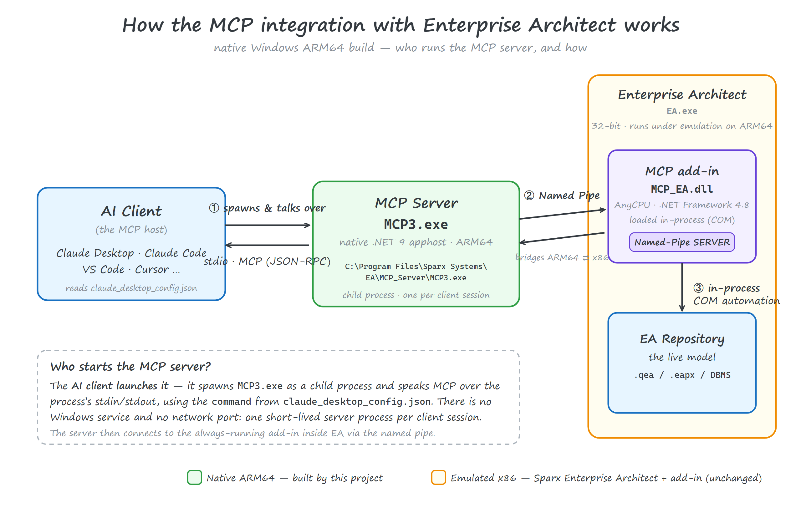

# MCP Server for Enterprise Architect — native **Windows ARM64** repackage

[](https://github.com/klesajos/enterprise-architect-mcp-arm64/actions/workflows/build.yml)
[](LICENSE)


[](https://www.sparxsystems.jp/en/MCP/)


Build a **native Windows on ARM64** installer for Sparx Systems' *MCP Server for Enterprise
Architect* from the official x86/x64 release.

> [!IMPORTANT]
> **All credit for the actual product goes to Sparx Systems.** This repository contains **no
> Sparx binaries** — only build tooling that re-targets the official installer you download
> yourself. The original *MCP Server for Enterprise Architect* is created and distributed by
> **Sparx Systems Japan**: <https://www.sparxsystems.jp/en/MCP/>

---

## Quick start

> **Install/run** needs **Windows on ARM64** with the **.NET 9 (Arm64) runtime**. You can *build* on
> any Windows that has the [.NET 9 SDK](https://dotnet.microsoft.com/download/dotnet/9.0); WiX is
> restored automatically. Full details in [Prerequisites](#prerequisites).

```powershell
# 1) Download the official Sparx installer (x64) — https://www.sparxsystems.jp/en/MCP/
#    e.g. to $HOME\Downloads\MCP_EA_x64.msi   (this repo ships no Sparx binaries)
#    Verify it's genuine — Sparx publishes no checksums, so the Authenticode signature is
#    the only integrity check (build.ps1 enforces this too; expect Status "Valid" and
#    signer "Sparx Systems Japan Co., Ltd."):
Get-AuthenticodeSignature "$HOME\Downloads\MCP_EA_x64.msi" | Format-List Status, SignerCertificate

# 2) Build the native ARM64 MSI
git clone https://github.com/klesajos/enterprise-architect-mcp-arm64.git
cd enterprise-architect-mcp-arm64
# (if PowerShell blocks scripts, prefix with:  powershell -ExecutionPolicy Bypass -File )
.\build.ps1 -SourceMsi "$HOME\Downloads\MCP_EA_x64.msi"      # -> dist\MCP_EA_arm64.msi

# 3) Install it   (uninstall later with:  msiexec /x dist\MCP_EA_arm64.msi )
msiexec /i dist\MCP_EA_arm64.msi
```

Then open **Enterprise Architect** (tick **Load on Startup** for *MCPAddin*) and point your MCP client
at `C:\Program Files\Sparx Systems\EA\MCP_Server\MCP3.exe` — see
[Connect your MCP client](#connect-your-mcp-client). ⚠️ Keep **only one** EA instance running
([why](#run-only-one-enterprise-architect-instance)).

---

## How it works



The AI client (Claude Desktop, Claude Code, …) **starts the MCP server itself** — it spawns
`MCP3.exe` as a child process and speaks MCP over stdio. The server then connects over a **named
pipe** to the `MCP_EA.dll` add-in running *inside* Enterprise Architect, which reaches the live model
through in-process **COM**. Because that bridge is a named pipe, the **native ARM64 server works with
the (emulated x86) EA add-in unchanged**.

> Diagram sources: [`docs/architecture.svg`](docs/architecture.svg) (canonical, hand-tuned) and
> [`docs/architecture.excalidraw`](docs/architecture.excalidraw) (editable sketch — open it at
> [excalidraw.com](https://excalidraw.com)). The PNG above is rendered from the SVG by
> [`tools/render-diagram.ps1`](tools/render-diagram.ps1) — see [`docs/README.md`](docs/README.md)
> for what is generated from what.

---

## Why this exists

Sparx ships the MCP server only as **x86** (`Intel`) and **x64** MSIs. On Windows on ARM neither
installs/runs natively:

- the MSI `Template` is hard-coded to `Intel`/`x64`, which Windows Installer uses to gate install
  eligibility;
- the launcher `MCP3.exe` is a **native x86/x64 .NET apphost**;
- the installer's `.NET 9` runtime check is a **native x64 custom-action DLL** that cannot load
  during an ARM64 install.

The good news from reverse-engineering the MSI: **only the packaging is CPU-specific.** The product
is a framework-dependent **.NET 9** app whose code is fully portable:

- `MCP3.dll` (the server), `MCP_EA.dll` (the EA add-in) and **all** dependencies are **AnyCPU/IL**;
- the server talks to AI clients over **stdio** and to Enterprise Architect over a **named pipe** —
  it never calls EA's COM directly — so a **native ARM64 server happily drives an emulated x64/x86
  EA add-in**.

```
AI client ──stdio──► MCP3.exe (.NET 9 server) ──named pipe──► MCP_EA.dll add-in (inside EA) ──COM──► EA Repository
```

So the only thing that needs to change for native ARM64 is: a native **arm64 apphost**, an **Arm64
MSI**, fixed **add-in registration**, and dropping the native runtime-check. That is exactly what
`build.ps1` does.

## What the build produces / changes

| | Official x64 MSI | This ARM64 MSI |
|---|---|---|
| MSI `Template` | `x64` | **`Arm64`** |
| `MCP3.exe` | native x64 apphost | **native arm64 apphost** |
| Managed payload (`MCP3.dll`, `MCP_EA.dll`, deps) | AnyCPU | **reused byte-for-byte** |
| EA add-in registration | `EAAddins64` (64-bit view) | **`EAAddins` + `EAAddins64` in both 32- and 64-bit views** |
| .NET runtime check | native x64 custom action | removed (the apphost prompts if the runtime is missing) |
| Install directory | follows EA's install path (registry search) + chooser dialog | **follows EA's install path (registry search)**, no dialog — silent default-path install |

The add-in is registered for **both 32-bit and 64-bit Enterprise Architect**. EA reads its add-in
keys from the registry view matching its *own* architecture, so registering in both views means the
add-in shows up whether you run 32-bit EA (`EA400`) or 64-bit EA (`EA64`) under emulation.

## Prerequisites

- **Windows on ARM64** (to install/run the result; you can *build* on any Windows + .NET SDK).
- **.NET SDK 9.0+** — <https://dotnet.microsoft.com/download/dotnet/9.0> (the arm64 build also needs
  the **.NET 9 arm64 *runtime*** at install/run time; the apphost will prompt with a download link if
  it's missing).
- **The official Sparx MSI** — download it yourself from Sparx Systems (this repo ships none):
  - Product page: <https://www.sparxsystems.jp/en/MCP/> · release notes: <https://www.sparxsystems.jp/en/MCP/releases.htm>
  - Direct downloads: **x64** (recommended) <https://www.sparxsystems.jp/en/MCP/bin/MCP_EA_x64.msi>
    · **x86** <https://www.sparxsystems.jp/en/MCP/bin/MCP_EA_x86.msi>
  - Either works as the source — the managed payload is identical; `build.ps1` only swaps the apphost.
  - **Verify the download.** Sparx publishes no checksums, so the MSI's Authenticode signature is the
    only way to confirm an unaltered installer: `Get-AuthenticodeSignature <msi> | Format-List Status,
    SignerCertificate` must show Status `Valid` with signer `Sparx Systems Japan Co., Ltd.`
    (or Explorer ▸ Properties ▸ Digital Signatures). `build.ps1` checks this automatically and
    refuses unsigned/foreign MSIs — `-SkipSignatureCheck` overrides if Sparx ever rotates its
    certificate before the tooling catches up.
- WiX is **not** a manual prerequisite — it's pinned as a local `dotnet` tool
  (`.config/dotnet-tools.json`) and restored automatically by the build.

## Build

```powershell
git clone https://github.com/klesajos/enterprise-architect-mcp-arm64.git
cd enterprise-architect-mcp-arm64
.\build.ps1 -SourceMsi "$HOME\Downloads\MCP_EA_x64.msi"
```

> If PowerShell refuses with *“running scripts is disabled on this system”*, run it as
> `powershell -ExecutionPolicy Bypass -File .\build.ps1 -SourceMsi "$HOME\Downloads\MCP_EA_x64.msi"`
> (or `Set-ExecutionPolicy -Scope Process Bypass` once per session).

Optional parameters (full help: `Get-Help .\build.ps1 -Detailed`):

- `-OutDir <path>` — where to write the MSI (default: `.\dist`).
- `-KeepWork` — keep the intermediate `.\build` folder for inspection; the natural first step
  when debugging a failed build.
- `-SkipSignatureCheck` — bypass the Authenticode check of the source MSI (only if Sparx rotates
  its code-signing certificate before the tooling catches up).
- `-AllowFallbackDefaults` — build even when version/ProgID/CLSID detection fails and hardcoded
  v2.7.3-era defaults are used (normally refused — it usually means Sparx restructured the installer).

Output: `dist\MCP_EA_arm64.msi`. The script auto-detects the product version, add-in ProgID, CLSID
and assembly identity from *your* MSI, so it should keep working for future Sparx releases — see
[Updating (new Sparx release)](#updating-new-sparx-release).

## Install

```powershell
msiexec /i dist\MCP_EA_arm64.msi
```

Then:

1. Open **Enterprise Architect** with a project, go to **Specialize ▸ Add-Ins ▸ Manage Add-Ins**,
   and confirm **MCPAddin** appears. Tick **Load on Startup**.
2. Point your MCP client at the installed server (see below).

> **EA must be running** with the add-in loaded whenever you use the tools: the server connects to
> the add-in *inside* EA over a named pipe. The MCP client **spawns the server for you** — you never
> launch `MCP3.exe` manually.

## Updating (new Sparx release)

Download the new official MSI, rebuild, and install over the top — **no uninstall needed**:

```powershell
.\build.ps1 -SourceMsi "$HOME\Downloads\MCP_EA_x64.msi"   # the NEW official MSI
msiexec /i dist\MCP_EA_arm64.msi
```

The MSI declares a major upgrade with a stable `UpgradeCode` (and `AllowSameVersionUpgrades`), so the
new build automatically replaces the previous install — even when the version number is unchanged.
Downgrades are blocked. Your MCP client config keeps working (the `MCP3.exe` path doesn't change).

## Uninstall

*Settings ▸ Apps ▸ Installed apps* ▸ **MCP Server for Enterprise Architect (Arm64)** ▸ Uninstall, or
`msiexec /x dist\MCP_EA_arm64.msi`. Note the `msiexec /x <file>` form only works with the **exact MSI
file that was installed** — every rebuild gets a fresh ProductCode — so after a rebuild prefer
*Settings ▸ Apps*.

## Run only ONE Enterprise Architect instance

> [!WARNING]
> The MCP server connects to the **first Enterprise Architect instance that was started**, and it
> stays bound to that one. It does **not** follow your focus or the most recently opened window.
>
> So if a **second EA instance** is running, the server will operate on the **wrong one**. The most
> common way this happens: you already have EA open, then you **open another project** in a way that
> **launches a new EA process** — now there are two. The server keeps talking to the *first*
> (possibly empty / different) instance, while you're looking at the project in the *second* one, and
> your tool calls seem to hit the "wrong" or an empty model.
>
> **To work correctly, keep exactly one EA instance running:**
> - Open additional projects **inside the existing EA window** (`File ▸ Open Project`) instead of
>   starting a new EA process.
> - Don't open `.qea`/`.eapx` files by double-clicking if EA is already open and that would spawn a
>   second instance — switch projects within the running instance instead.
> - Check Task Manager for more than one `EA.exe` and close the extras.
>
> **If it's already talking to the wrong instance:** close **all** EA instances, then start a single
> EA with the project you want. (The server re-attaches on its next call; if needed, restart your MCP
> client so it re-spawns the server cleanly.)

## Connect your MCP client

The server is a standard **stdio** MCP server, so every client uses the same `command` + `args`:

- **`command`**: `C:\Program Files\Sparx Systems\EA\MCP_Server\MCP3.exe`
- **`args`** (optional): `-enableEdit` (allow write/modify tools, not just read) and
  `-setTimeout 60` (per-operation timeout, seconds).

After any config change, **fully restart the client** so it re-spawns the server.

### Claude Desktop

Edit `%APPDATA%\Claude\claude_desktop_config.json` (create it if missing), then fully quit and
reopen the app:

```json
{
  "mcpServers": {
    "enterprise-architect": {
      "command": "C:\\Program Files\\Sparx Systems\\EA\\MCP_Server\\MCP3.exe",
      "args": ["-enableEdit", "-setTimeout", "60"]
    }
  }
}
```

### Claude Code (CLI)

One command — pick the scope (`user` = all your projects, recommended; `local` = just this project,
private; `project` = shared via a committed file). Everything after `--` is passed to `MCP3.exe`:

```powershell
claude mcp add --transport stdio --scope user enterprise-architect -- "C:\Program Files\Sparx Systems\EA\MCP_Server\MCP3.exe" -enableEdit -setTimeout 60
```

Verify with `claude mcp list` (should show `enterprise-architect ✓`) or `/mcp` inside a session.

### Claude Code — project-scoped (shared with a repo)

Put a file named **`.mcp.json`** in the **root of *your own* project** (the repo where you use Claude
Code — *not* this build repo) and commit it to share with the team. Note the extra `"type": "stdio"`
field that Claude Code expects:

```json
{
  "mcpServers": {
    "enterprise-architect": {
      "type": "stdio",
      "command": "C:\\Program Files\\Sparx Systems\\EA\\MCP_Server\\MCP3.exe",
      "args": ["-enableEdit", "-setTimeout", "60"]
    }
  }
}
```

The first time you open Claude Code in that project it will ask you to **approve** the server from
`.mcp.json` (reset later with `claude mcp reset-project-choices`).

> **Sharing across machines:** the `command` is an absolute Windows path. If teammates installed EA
> elsewhere (or aren't all on Windows), have each set an environment variable and reference it instead,
> e.g. `"command": "${MCP_EA_PATH}"`. Each client config (Claude Desktop vs Claude Code) is separate —
> they do **not** share MCP settings.

## Troubleshooting

- **The add-in doesn't appear in *Manage Add-Ins*.** EA reads add-in registrations only at startup —
  fully close and reopen EA after installing. This MSI registers for **both** 32-bit (`EA400`) and
  64-bit (`EA64`) EA, so a bitness mismatch shouldn't be the cause; confirm `MCP_EA.dll` exists in
  `C:\Program Files\Sparx Systems\EA\MCP_Addin\`.
- **Tools fail with *“Failed to connect to Enterprise Architect”* / time out.** Almost always means
  **no project is open in EA** (or EA isn't running). Open a repository first, then retry. For heavy
  operations raise the timeout, e.g. `-setTimeout 600` (EA runs under emulation, so it can be slow).
- **Tool calls hit the wrong / an empty model.** You have more than one EA instance running — see
  [Run only ONE Enterprise Architect instance](#run-only-one-enterprise-architect-instance).
- **The client shows no server/tools.** Fully restart the MCP client after editing its config (it
  spawns the server at startup). Check `claude mcp list` (Claude Code) or the client's MCP log, and
  verify the `command` path exists.
- ***“.NET runtime not found”* when the server starts.** Install the **.NET 9 Desktop Runtime (Arm64)**:
  <https://dotnet.microsoft.com/download/dotnet/9.0>.
- **SmartScreen / *“unknown publisher”* on install.** Expected — the rebuilt MSI is unsigned (it can't
  carry Sparx's signature). Choose *More info ▸ Run anyway*, or self-sign it.
- **`build.ps1` won't run (*“running scripts is disabled”*).** Use
  `powershell -ExecutionPolicy Bypass -File .\build.ps1 -SourceMsi <path-to-official-msi>`.

## Cheat sheets

Quick references for the EA MCP tools (what they do, common prompts, gotchas):

- 🇬🇧 English — [`docs/EA-MCP-cheatsheet-en.md`](docs/EA-MCP-cheatsheet-en.md)
  ([PDF](docs/EA-MCP-cheatsheet-en.pdf))
- 🇨🇿 Čeština — [`docs/EA-MCP-cheatsheet-cs.md`](docs/EA-MCP-cheatsheet-cs.md)
  ([PDF](docs/EA-MCP-cheatsheet-cs.pdf))

## How the build works

`build.ps1`:

1. **Administrative-extracts** your Sparx MSI (`msiexec /a`) — no system changes — to harvest the
   managed payload.
2. **Mints a native arm64 apphost** by building the tiny `apphost/MCP3.csproj` with
   `-r win-arm64`, keeping only the produced `MCP3.exe`. A framework-dependent apphost has no hash
   binding to its managed DLL, so this launcher drives Sparx's unmodified `MCP3.dll`.
3. **Assembles the payload**: Sparx's managed binaries + the arm64 apphost.
4. **Builds the MSI** from `src/MCP_EA_arm64.wxs` with WiX (`-arch arm64`), injecting the
   auto-detected version/ProgID/CLSID/assembly values.

The architecture image (`docs/architecture.png`) is rasterized from `docs/architecture.svg` by
[`tools/render-diagram.ps1`](tools/render-diagram.ps1) (headless Edge). Run it after editing the SVG —
or after re-exporting an SVG from `docs/architecture.excalidraw` — to keep the PNG in sync.

## Repository layout

```
build.ps1                     # one-shot build script (start here)
src/MCP_EA_arm64.wxs          # WiX authoring for the ARM64 MSI
apphost/                      # throwaway project that mints the arm64 MCP3.exe apphost
tools/render-diagram.ps1      # regenerate docs/architecture.png from the SVG (headless Edge)
.config/dotnet-tools.json     # pins WiX as a local dotnet tool
docs/                         # architecture diagram (+ .excalidraw source) and cheat sheets
```

## Notes & caveats

- The produced MSI is **unsigned** — it cannot carry Sparx's original signature. Windows SmartScreen
  may warn on first run. Build it yourself / use at your own discretion.
- The MSI you build **contains Sparx's proprietary binaries**, harvested from your copy of the
  official installer. It is for **your own use** — do **not** redistribute it unless Sparx's license
  terms permit it. The MIT license covers this repo's tooling only, never the build output.
- It shares its **UpgradeCode** with the official installer, so installing it **replaces** any existing
  official x86/x64 install of the same product (and vice-versa) — the two cannot coexist. Uninstall
  with `msiexec /x dist\MCP_EA_arm64.msi` or via *Settings ▸ Apps*.
- **Running EA in Wine / CrossOver (Linux, macOS)?** Don't use this build — Wine presents an
  x86/x64 Windows environment even on ARM64 hosts (Apple Silicon runs x64 code via Rosetta), so the
  Arm64 MSI won't install and the arm64 `MCP3.exe` can't run. Use the **official Sparx x64/x86 MSI**
  inside the same Wine prefix as EA instead. Note that Sparx supports EA itself under Wine/CrossOver
  but states the MCP Server is Windows-only (*"Linux and macOS are not supported"*) — if you try it
  anyway, the MCP client must spawn the server **through `wine`** in that same prefix (with the
  Windows .NET 9 Desktop Runtime installed in it); the named pipe between server and add-in does not
  cross the prefix boundary, so a host-native server cannot connect.
- This is an **independent, unofficial** repackage for interoperability on ARM64. It is **not
  affiliated with or endorsed by Sparx Systems.** Please support Sparx and obtain the product from
  them: <https://www.sparxsystems.jp/en/MCP/>
- Trademarks (Sparx Systems, Enterprise Architect) belong to their respective owners.

## License

Build tooling in this repo: **MIT** (see [LICENSE](LICENSE)). The MIT license covers *only* this
tooling — **not** the Sparx product, which it neither contains nor relicenses, and therefore **not
the MSI you build**, which does contain Sparx's binaries. See [NOTICE](NOTICE) for the exact scope
and attribution.
